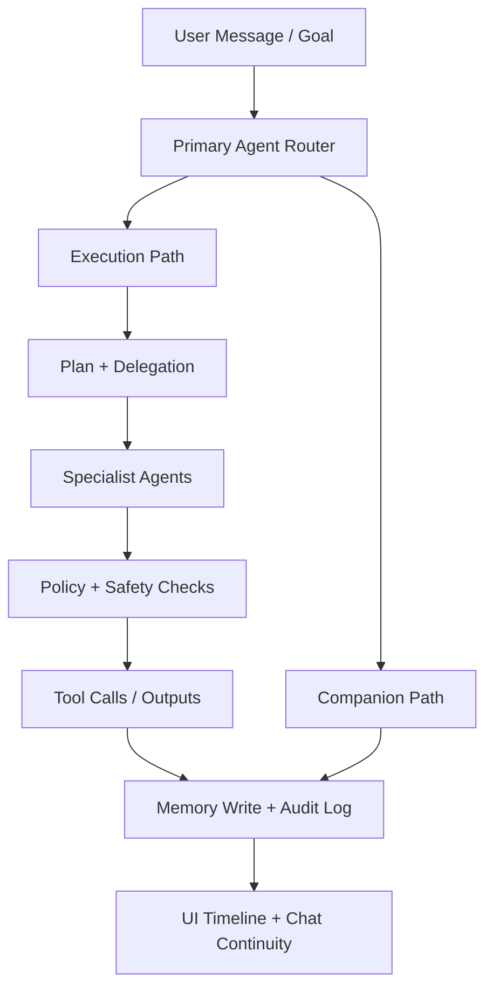
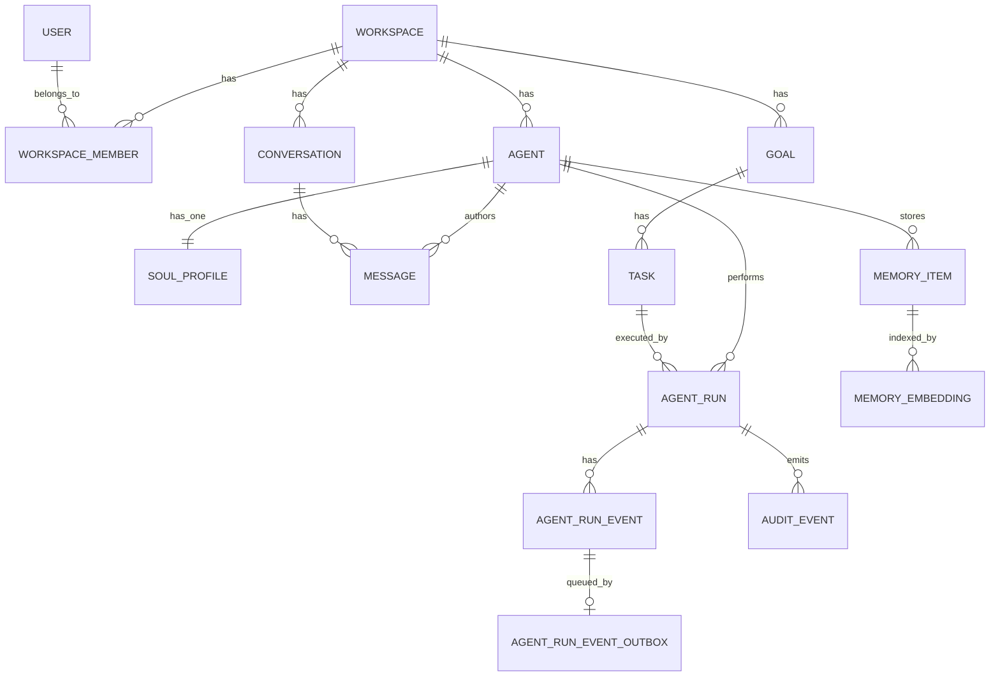

# feat: Agent-Native Companion Dual-Mode v1

## Enhancement Summary
**Deepened on:** 2026-02-11  
**Sections enhanced:** 7  
**Research inputs used:** `deepen-plan`, `agent-native-architecture`, `security-sentinel`, `performance-oracle`, `kieran-python-reviewer`, `kieran-typescript-reviewer`, `data-integrity-guardian`, official framework documentation

### Key Improvements
1. Added concrete execution boundaries for FastAPI and TanStack Start (server-only logic, lifecycle, and middleware placement).
2. Added vector/memory portability strategy across SQLite and pgvector/Supabase with explicit indexing and migration constraints.
3. Added stronger security and operability gates (SQLCipher key handling, approval policies, auditability, and measurable SLOs).
4. Added deterministic event streaming contract (outbox + monotonic sequence + replay cursor).
5. Added v1 policy defaults to unblock phase acceptance criteria and reduce scope ambiguity.
6. Added explicit deployment security/compatibility requirements for Supabase RLS and SQLite encrypted-vector runtime.

### New Considerations Discovered
- TanStack Start loaders can run on both server and client, so privileged operations must be isolated in server functions.
- pgvector/Supabase indexing strategy and query interface should be defined early to avoid retrieval regressions later.
- No project-level institutional learnings were found yet in `docs/solutions/`.

## Overview
Build a self-hosted web application where users can both:
1. chat/roleplay with one or two primary agents, and
2. execute goals through a customizable team of specialist agents.

v1 is optimized for solo power users and small trusted groups, with secure-by-default foundations, database-first memory, and modular capabilities so deployments only include what they use.

Selected stack:
- Backend: Python + FastAPI
- Frontend: TanStack Start + Tailwind CSS
- Memory DBs: SQLite (default) with vectors; PostgreSQL + pgvector and Supabase support

## Problem Statement
Current agent apps often force one of two poor tradeoffs:
- Great chat identity and memory, weak task execution
- Strong orchestration, weak companion continuity

Many also ship as kitchen-sink bundles with excessive dependencies and weak security defaults. We need a modular, secure baseline with first-class dual-mode behavior and portable memory across supported databases.

## Proposed Solution
Implement a dual-mode core architecture with:
- Shared identity/memory substrate for companion and execution modes
- Agent runtime with clear role boundaries (primary agent, specialist agents, human users)
- Capability-gated actions with policy checks and human confirmations
- Storage abstraction that provides one memory API over SQLite/PG/Supabase
- Secure defaults (encryption at rest, field-level encryption for sensitive memory, auditable action logs)

## Technical Approach

### Architecture
- Monorepo layout:
  - `apps/web/` TanStack Start UI
  - `apps/api/` FastAPI backend
  - `apps/worker/` async worker for long-running agent tasks
  - `packages/contracts/` shared API schemas (OpenAPI-generated types)
  - `packages/agent-packs/` optional specialist agent definitions
- Runtime split:
  - API handles session, orchestration triggers, CRUD, policy checks
  - Worker executes plans/tool calls and writes event stream updates
  - UI subscribes to streamed updates for chat + execution timeline
- Event streaming contract (required for deterministic replay):
  - Persist all run events in append-only `agent_run_event` table with monotonic `seq` per `agent_run_id`
  - Publish via outbox worker (`agent_run_event_outbox`) for SSE/WebSocket fan-out
  - Client resume token is `(agent_run_id, last_seq)` and server replays missing events before tailing live stream

### Research Insights
**Best Practices:**
- Use FastAPI lifespan handlers (`FastAPI(lifespan=...)`) for startup/shutdown resources (model clients, connection pools, worker producers).
- Keep secrets and privileged fetch logic in server-only boundaries; route loaders can execute in both environments in TanStack Start.
- Apply middleware in two layers: request-wide middleware and per-server-function middleware for capability scoping.

**Implementation Details:**
```python
# apps/api/main.py
from contextlib import asynccontextmanager
from fastapi import FastAPI

@asynccontextmanager
async def lifespan(app: FastAPI):
    # initialize shared resources (clients, pools, schedulers)
    yield
    # release resources
    # app.state.db.close() / client.shutdown()
    return

app = FastAPI(lifespan=lifespan)
```

```tsx
// apps/web/src/lib/server/get-workspace.ts
import { createServerFn } from '@tanstack/react-start'

export const getWorkspace = createServerFn({ method: 'GET' }).handler(async () => {
  // server-only secrets and privileged API calls belong here
})
```

**Edge Cases:**
- Streaming disconnects: define idempotent resume behavior for goal execution timeline.
- Long-running orchestrations: keep API request path short; offload execution to worker and stream status.
- Duplicate delivery from retries: de-duplicate by `(agent_run_id, seq)` and require idempotent consumer behavior.

### Agent Model
- Primary agents:
  - `companion_primary`: tone, roleplay, continuity
  - `executor_primary`: planning/delegation and result synthesis
- Specialist agents:
  - User-configurable prompts, "soul" metadata, enabled tools, memory scopes
- Delegation model:
  - Planner creates explicit subtasks with expected outputs
  - Worker dispatches to specialist agents with scoped context
  - Results merged and attributed by source agent

### Memory & Data Layer
- Persistence abstraction:
  - `MemoryStore` interface with adapters:
    - `SqliteMemoryStore` (default)
    - `PostgresMemoryStore` (pgvector-compatible, used by Supabase)
- Memory domains:
  - `episodic_memory` (events/interactions)
  - `semantic_memory` (facts/preferences)
  - `working_memory` (short-lived task context)
  - `soul_profile` (identity/personality constraints)
- Vector strategy:
  - SQLite: vector extension support with pinned compatible version
  - PostgreSQL/Supabase: pgvector indexes with cosine distance
  - Shared retrieval contract regardless of backend
  - SQLite default profile requires validated SQLCipher + vector-extension compatibility in CI and release artifacts

### Research Insights
**Best Practices:**
- Enforce a single embedding dimension per memory table/collection; version embedding models explicitly to prevent mixed-vector corruption.
- Start with exact search correctness; add ANN indexes (`hnsw`/`ivfflat`) only after baseline relevance metrics are captured.
- For Supabase/PostgREST flows, expose vector search via SQL/RPC functions for consistent, typed retrieval.

**Performance Considerations:**
- pgvector indexing and distance operator must match query behavior (`vector_cosine_ops` for cosine).
- Add adapter conformance tests that compare top-k results across SQLite and Postgres within a tolerance band.

**Implementation Details:**
```sql
-- PostgreSQL / Supabase
create extension if not exists vector;

create table memory_embedding (
  id bigserial primary key,
  workspace_id bigint not null,
  memory_item_id bigint not null,
  embedding vector(1536) not null
  ,constraint fk_memory_embedding_workspace
    foreign key (workspace_id) references workspace(id) on delete cascade
  ,constraint fk_memory_embedding_memory_item
    foreign key (memory_item_id) references memory_item(id) on delete cascade
);

create index if not exists memory_embedding_hnsw_cos
  on memory_embedding using hnsw (embedding vector_cosine_ops);

create index if not exists memory_embedding_workspace_idx
  on memory_embedding (workspace_id);
```

**Edge Cases:**
- Backend migration (SQLite -> Postgres): preserve embedding model metadata and regenerate vectors when dimensions differ.
- Mixed precision across providers: define normalization and distance contract in `MemoryStore`.
- Cross-workspace leakage: all retrieval queries must include `workspace_id` and authorized scope filters.

### Security Baseline
- Authentication:
  - Owner bootstrap flow
  - Invite-only user onboarding for small trusted groups
- Authorization:
  - RBAC v1: `owner`, `member`
  - Agent capability scopes: `read_memory`, `write_memory`, `run_tool`, `delegate`, `external_action`
- Encryption:
  - SQLite encrypted at rest (SQLCipher-compatible)
  - Field-level encryption for sensitive memory payloads (envelope pattern)
  - Secret management via environment + pluggable KMS later
- Safety controls:
  - Policy engine for blocked/allowed tool categories
  - Human-in-the-loop confirmations for high-impact actions
  - Immutable audit log for delegated actions and tool outputs
- v1 policy defaults (to remove implementation ambiguity):
  - High-impact actions requiring approval: filesystem write/delete outside app workspace, external HTTP requests to non-allowlisted domains, shell command execution, credential/secret mutations
  - Invited members may use existing specialist agents but cannot create/edit specialist agent definitions (owner-only)
- Supabase requirements (when using Supabase adapter):
  - Row Level Security (RLS) enabled on all tenant-scoped tables
  - Policies must enforce `workspace_id` isolation for `select`, `insert`, `update`, and `delete`
  - Service-role credentials prohibited in user-request execution path; reserved for controlled maintenance jobs only

### Research Insights
**Best Practices:**
- For SQLCipher, set the key immediately after opening the database handle before any schema/data operation.
- Treat delegated tool execution as default-deny and require explicit allow-lists by tool category and workspace role.
- Apply FastAPI global dependencies for baseline authn/authz checks, then enforce finer policy at route/tool boundaries.

**Implementation Details:**
```python
# apps/api/db/sqlite.py
from pysqlcipher3 import dbapi2 as sqlcipher

conn = sqlcipher.connect("memory.db")
conn.execute("PRAGMA key = ?;", (db_key,))
conn.execute("PRAGMA foreign_keys = ON;")
cipher_version = conn.execute("PRAGMA cipher_version;").fetchone()
if not cipher_version or not cipher_version[0]:
    raise RuntimeError("SQLCipher is not active; refusing to start insecure SQLite mode")
```

**Edge Cases:**
- Key rotation: define runbook using offline re-encryption and rollback checkpoints.
- WebSocket auth: do not rely on query tokens for long-lived sessions; prefer header/cookie auth with expiry and revalidation.
- Runtime misconfiguration: fail closed if SQLCipher is unavailable instead of silently falling back to plaintext SQLite.

### Frontend Experience
- Dual-mode shell in one UI:
  - `Companion` tab: conversational + roleplay continuity
  - `Execution` tab: goals, plans, delegated tasks, status timeline
- Agent Studio:
  - Create/edit specialist agents with prompt/soul/capability settings
- Memory controls:
  - Per-agent memory scope selection
  - Memory review and redaction UX

### Research Insights
**Best Practices:**
- Use Tailwind theme variables and custom breakpoints to encode design tokens early instead of hardcoding style primitives.
- Keep sensitive data fetching in server functions; loaders should consume safe, already-authorized payloads.
- Add explicit mobile-first layout requirements for chat stream, execution timeline, and agent studio forms.

**Implementation Details:**
```css
/* apps/web/src/styles/app.css */
@import "tailwindcss";

@theme {
  --breakpoint-xs: 30rem;
  --breakpoint-3xl: 120rem;
}
```

**Edge Cases:**
- SSR hydration mismatch for time-sensitive timeline rows; define stable server/client formatting strategy.
- Roleplay and execution tabs open concurrently on mobile; define conflict handling for draft states.

### Modular Packaging
- Keep v1 install minimal:
  - Core ships with baseline models/providers and local DB support
  - Optional agent/tool packs installed separately
- Avoid bundling heavyweight providers/integrations unless enabled

## User Flow Overview (SpecFlow)
1. Owner bootstrap -> create workspace -> create primary agents -> start first chat.
2. User creates goal in Execution mode -> primary executor plans subtasks -> delegates to specialists -> returns consolidated result.
3. User switches to Companion mode -> same identity and historical memory persist naturally.
4. User edits specialist prompt/soul -> subsequent delegations use updated behavior.
5. User reviews memory artifacts and audit logs -> redacts sensitive entries.



## Flow Permutations Matrix
| Flow | Solo Owner | Invited Member | SQLite | PostgreSQL/Supabase | Failure Path |
|---|---|---|---|---|---|
| Bootstrap | Yes | No | Yes | Yes | Invalid setup token, retry |
| Companion Chat | Yes | Yes | Yes | Yes | Provider timeout with retry/backoff |
| Goal Execution | Yes | Yes (if allowed) | Yes | Yes | Delegation failure, partial results shown |
| Agent Customization | Yes | Limited | Yes | Yes | Invalid prompt/policy conflict |
| Memory Redaction | Yes | Limited | Yes | Yes | Redaction denied by role/scope |

## Implementation Phases

### Phase 1: Foundation (1-2 weeks)
- Deliverables:
  - `apps/api/main.py` FastAPI service skeleton with OpenAPI
  - `apps/web/src/routes/__root.tsx` TanStack Start app shell
  - `apps/api/db/migrations/` initial schema + adapter interface
  - `apps/api/security/crypto.py` encryption primitives
  - `apps/api/events/outbox.py` event outbox + sequence publisher
  - `docs/architecture/dual-mode-core.md`
- Success criteria:
  - Owner can bootstrap workspace and authenticate
  - DB adapters run in SQLite and Postgres modes
  - Server-only data boundaries are verified in TanStack Start route tests
  - Event replay from `(agent_run_id, last_seq)` passes deterministic ordering tests
  - SQLite default profile is validated with SQLCipher + vector extension on supported target platforms

### Phase 1 Execution Progress (2026-02-11)
- [x] Monorepo scaffold created: `apps/api`, `apps/web`, `apps/worker`, `packages/contracts`, `packages/agent-packs`.
- [x] Added `apps/api/main.py` FastAPI lifecycle skeleton with `/health` endpoint.
- [x] Added `apps/api/db/migrations/0001_initial.sql` with core tables and outbox/event sequencing constraints.
- [x] Added shared memory contract and adapter stubs for SQLite/Postgres in `apps/api/db/`.
- [x] Added SQLCipher fail-closed connection validation in `apps/api/db/sqlite.py`.
- [x] Added deterministic replay/outbox utility in `apps/api/events/outbox.py`.
- [x] Added dual-mode shell and route placeholders in `apps/web/src/routes/` and server-only boundary in `apps/web/src/lib/server/get-workspace.ts`.
- [x] Added architecture implementation doc at `docs/architecture/dual-mode-core.md`.
- [x] Added lightweight validation tests for backend and frontend scaffold structure.

### Phase 2: Dual-Mode Core + Agent Team (2-3 weeks)
- Deliverables:
  - `apps/api/agents/runtime.py` primary/specialist orchestration
  - `apps/api/agents/policy.py` capability and safety checks
  - `apps/api/memory/store_*.py` memory adapters with vector retrieval
  - `apps/web/src/routes/companion.tsx`
  - `apps/web/src/routes/execution.tsx`
  - `apps/web/src/routes/agent-studio.tsx`
- Success criteria:
  - Chat + roleplay continuity works across sessions
  - Goal execution delegates to at least one specialist and returns traceable results
  - Delegation events stream to UI with deterministic ordering and retry-safe resume

### Phase 3: Security Hardening + Operability (1-2 weeks)
- Deliverables:
  - `apps/api/audit/logging.py` immutable audit trail
  - `apps/api/auth/invitations.py` invite flow for small groups
  - `apps/api/safety/approvals.py` human approval workflow
  - `deploy/docker-compose.yml` minimal self-host stack
  - `docs/security/threat-model-v1.md`
- Success criteria:
  - Sensitive memory fields encrypted and decryptable only with configured keys
  - High-impact actions require explicit user confirmation
  - Security review checklist passes for authn/authz, input validation, and tool-policy enforcement
  - SQLCipher activation check is enforced at startup for SQLite deployments

### Phase 4: V1 Polish + Docs (1 week)
- Deliverables:
  - `docs/setup/self-hosted-quickstart.md`
  - `docs/user-guide/agent-studio.md`
  - `docs/user-guide/memory-controls.md`
  - `docs/ops/backup-restore.md`
- Success criteria:
  - New user can self-host and complete first conversation + delegated goal in under 30 minutes
  - Backup/restore drill executed successfully on SQLite and Postgres deployment variants

## Alternative Approaches Considered
- Companion-first v1: rejected because execution would likely be shallow.
- Orchestrator-first v1: rejected because companion continuity would become secondary.
- Full multi-tenant v1: rejected (explicitly deferred to v2+) due high admin/security complexity.

## Acceptance Criteria

### Functional Requirements
- [ ] User can create and interact with one or two primary agents across Companion and Execution modes.
- [ ] Owner can create/edit specialist agents with custom prompts, soul metadata, and capability scopes.
- [ ] Invited members can use assigned specialist agents but cannot create/edit specialist agent definitions in v1.
- [ ] Execution mode supports delegated subtasks with per-agent attribution.
- [ ] Memory writes and retrievals work through a common API on SQLite and Postgres/Supabase backends.
- [ ] Owner can invite members with constrained permissions.
- [ ] Event timeline replay resumes exactly from `(agent_run_id, last_seq)` with no missing or out-of-order events.

### Non-Functional Requirements
- [ ] Encryption at rest enabled for SQLite deployments and documented for Postgres/Supabase deployments.
- [ ] Field-level encryption is applied to sensitive memory payloads before persistence.
- [ ] Audit log captures all delegated tool actions with actor, timestamp, and outcome.
- [ ] Core API p95 latency for chat request orchestration <= 350ms (excluding model completion latency).
- [ ] Application remains usable on modern desktop and mobile browsers.
- [ ] Retrieval p95 for top-k memory search <= 120ms on default index configuration.
- [ ] 0 high-severity findings on pre-release security audit checklist.
- [ ] Cross-workspace retrieval leakage rate is 0 in authorization test suite.

### Quality Gates
- [ ] Backend test suite covers auth, policy checks, memory adapters, and delegation paths.
- [ ] Frontend test suite covers dual-mode navigation and agent configuration workflows.
- [ ] Security checklist completed (secrets handling, authz checks, encryption validation).
- [ ] Documentation includes setup, backup/restore, and key rotation guidance.
- [ ] Performance benchmark script and fixture dataset are checked in and runnable in CI/local.
- [ ] Supabase adapter security tests verify RLS enforcement and prevent cross-workspace data access.
- [ ] SQLite encrypted-vector compatibility matrix is documented and verified in CI for supported environments.

## Performance Measurement Protocol
- Benchmark workload profile:
  - 50 concurrent users, 70% companion chat requests, 30% execution orchestration requests
  - Dataset fixture: 100 workspaces, 500 agents, 1,000,000 memory embeddings (dimension 1536)
- Measurement method:
  - 2-minute warmup, 10-minute steady-state run, 3 repeated trials
  - Report median and worst-trial p95 values
  - Exclude upstream LLM completion time from orchestration API latency SLO, but report both metrics
- Tooling:
  - API load: `k6` or `locust`
  - DB query sampling: native database stats + application timing spans
- Pass criteria:
  - `chat_orchestration_p95_ms <= 350`
  - `memory_topk_retrieval_p95_ms <= 120`

## Success Metrics
- At least 90% of delegated tasks finish with explicit success/failure status and traceable logs.
- First-run setup (self-host) median completion under 30 minutes.
- Less than 2% of requests fail due to policy/configuration ambiguity after onboarding.
- Users can switch between Companion and Execution without identity/memory discontinuity in core scenarios.

## Dependencies & Prerequisites
- Python runtime and package manager (`uv` or `pip` baseline)
- Node runtime for TanStack Start frontend
- SQLite default path; optional PostgreSQL 16+ with pgvector
- Optional Supabase project using Postgres adapter path
- LLM provider credentials configured through environment
- For Supabase deployments: RLS-enabled schema and vetted policy migration set

## Risk Analysis & Mitigation
- Risk: cross-DB vector behavior divergence.
  - Mitigation: backend adapter conformance tests with shared fixtures.
- Risk: unsafe delegated tool execution.
  - Mitigation: default-deny policies + approval gates + immutable audit logs.
- Risk: scope creep from customization requests.
  - Mitigation: strict v1 boundaries and deferred multi-tenant administration.
- Risk: migration friction SQLite -> Postgres.
  - Mitigation: explicit export/import format and migration utility in v1 docs.
- Risk: framework volatility (TanStack Start alpha evolution).
  - Mitigation: pin tested version range and isolate framework-specific integration behind thin wrappers.
- Risk: SQLite encrypted-vector runtime incompatibility on some environments.
  - Mitigation: publish tested compatibility matrix and fail installation when required capabilities are unavailable.

## ERD (v1 Core Models)


## Open Questions (To Resolve Before Build Start)
1. Which LLM providers are required for day-one support?
2. Which backup cadence is required for default self-host guidance?
3. Should v1 include a read-only auditor role, or defer to v2?

## Documentation Plan
- Author architecture doc and ADRs for:
  - dual-mode routing
  - memory adapter contract
  - security defaults
- Publish operator docs:
  - setup, upgrade, backup/restore, key rotation
- Publish user docs:
  - Companion vs Execution usage
  - Agent Studio customization
  - memory visibility and redaction

## References & Research
### Internal
- `docs/brainstorms/2026-02-10-agent-native-companion-platform-brainstorm.md`

### External
- FastAPI overview and patterns: https://fastapi.tiangolo.com/
- FastAPI dependencies with `yield`: https://fastapi.tiangolo.com/tutorial/dependencies/dependencies-with-yield/
- TanStack Start overview: https://tanstack.com/start/latest/docs/framework/react/overview
- TanStack Start code execution patterns: https://tanstack.com/start/latest/docs/framework/react/guide/code-execution-patterns
- Tailwind responsive design: https://tailwindcss.com/docs/responsive-design
- Tailwind theme variables: https://tailwindcss.com/docs/theme
- pgvector README and indexing guidance: https://github.com/pgvector/pgvector
- Supabase vector columns and query patterns: https://supabase.com/docs/guides/ai/vector-columns
- SQLCipher API and migration guidance: https://github.com/sqlcipher/sqlcipher
- sqlite-vec capabilities and metadata filters: https://github.com/asg017/sqlite-vec
